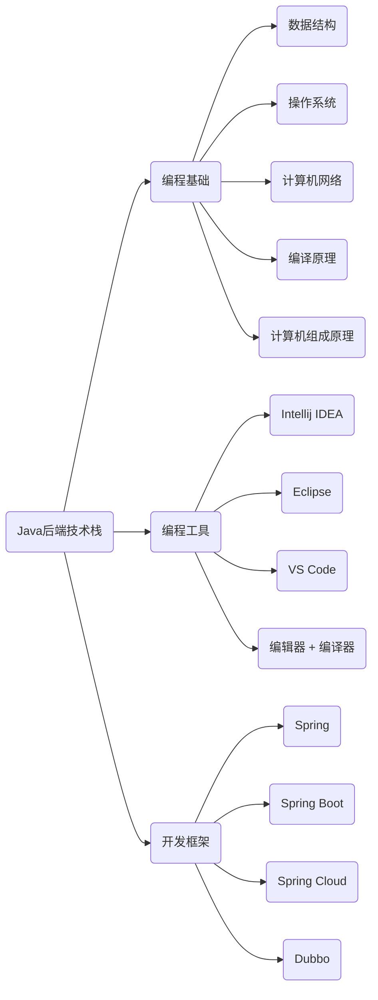

## Typora

### 什么是 Typora 呢？

引用一下[官网](https://www.typora.io/)的介绍

> Typora gives you a seamless experience as both a reader and a writer. It removes the preview window, mode switcher, syntax symbols of markdown source code, and all other unnecessary distractions. Instead, it provides a real live preview feature to help you concentrate on the content itself.

百度翻译下

> Typora给你一个读者和作家的无缝体验。它删除了预览窗口、模式切换程序、标记源代码的语法符号以及所有其他不必要的干扰。相反，它提供了一个真正的实时预览功能，帮助您专注于内容本身。

百度翻译的有点蹩脚，大致意思懂了就行。核心意思就是，**Typora 是一个可以实时渲染的markdown软件**，使用者可以在一边写markdown一边看到效果，而不是像 MarkdownPad 等其他 markdown 编辑软件那样分成两块，一块是源码区，一块是效果区。

其实 **Typora 类似于浏览器**，因为它可以将 markdown 解释成 html，同时可以采用 css 来定制样式，里面的很多功能都是通过 JavaScript 的库来实现的，比如我下面要说的<u>时序图</u>，<u>流程图</u>以及<u>脑图</u>。

### Typora 的功能

Typora 作为 markdown 的编辑器当然支持完善的 markdown 的语法，至于支持的 markdown 的常见的语法就不赘述了。[这里随便找了篇介绍 markdown 语法的简书博客](https://www.jianshu.com/p/191d1e21f7ed/)

### 为什么推荐 Typora ？ 

- 开源，简洁无广告，无弹窗，可纯净安装。
- 实时预览，提高效率也更酷。
- 实时保存，不需要再按 ctrl + s 了，可以改掉坏习惯了 。[笑]
- 可自由定制，熟悉前端的人可以修改 css，不熟悉的官网提供了大量的主题。
- 数学公式和作图十分方便。可以支持 LaTex/Tex 语法，也就是排版数学公式更加方便。

### 以作图为例

- 时序图（sequence）

Typora 通过 [js-sequence-diagram插件](https://bramp.github.io/js-sequence-diagrams/) 支持了sequence 图，比如我画一个简单的 TCP 三次握手的时序图。

```sequence
Client -> Server: TCP 第一次握手
Server -> Client: TCP 第二次握手
Client -> Server: TCP 第三次握手
```


实现代码如下，快捷方式就是打 " ``` "  + "sequence" + 回车  

```markdown
​```sequence
Client -> Server: TCP 第一次握手
Server -> Client: TCP 第二次握手
Client -> Server: TCP 第三次握手
​```
```

- 流程图（flowchart）

Typora 通过 [flowchart.js插件](http://flowchart.js.org/) 支持了sequence 图。举个简单的例子，如下。

```flow
st=>start: 程序开始
op=>operation: 进行操作
cn=>condition: 判断对错?
ed=>end: 结束

st->op->cn(yes)->ed
cn(no)->op
```

代码如下

``` markdown
​```flow
st=>start: 程序开始
op=>operation: 进行操作
cn=>condition: 判断对错?
ed=>end: 结束

st->op->cn(yes)->ed
cn(no)->op
​```
```

- 脑图（mind map）

Typora 通过 [mermaid 插件](https://mermaid-js.github.io/mermaid/#/) 支持了sequence 图，这个插件很强大，也可以画时序图和流程图。举个简单的例子，如下。



实现代码如下

```markdown
​```mermaid
graph LR
A(Java后端技术栈) --> B(编程基础)
B --> b0(数据结构)
B --> b1(操作系统)
B --> b2(计算机网络)
B --> b3(编译原理)
B --> b4(计算机组成原理)

A --> C(编程工具)
C --> a0(Intellij IDEA)
C --> a1(Eclipse)
C --> a2(VS Code)
C --> a3(编辑器 + 编译器)

A --> D(开发框架)
D --> d0(Spring)
D --> d1(Spring Boot)
D --> d2(Spring Cloud)
D --> d3(Dubbo)
​```
```


总之作为一名程序员，熟悉 markdown 是必须的事情，熟练使用 markdown 无疑会带来很多便利，增加很多效率。